# 🚀 Next.js Foundations Course
# Univeristas Muhammadiyah Makassar
### by devnolife

## 🎯 Pembukaan

Selamat datang di kursus Next.js Foundations! Dalam kursus interaktif gratis ini, Anda akan mempelajari fitur-fitur utama Next.js dengan membangun aplikasi web full-stack.

### 💰 Apa yang akan kita bangun
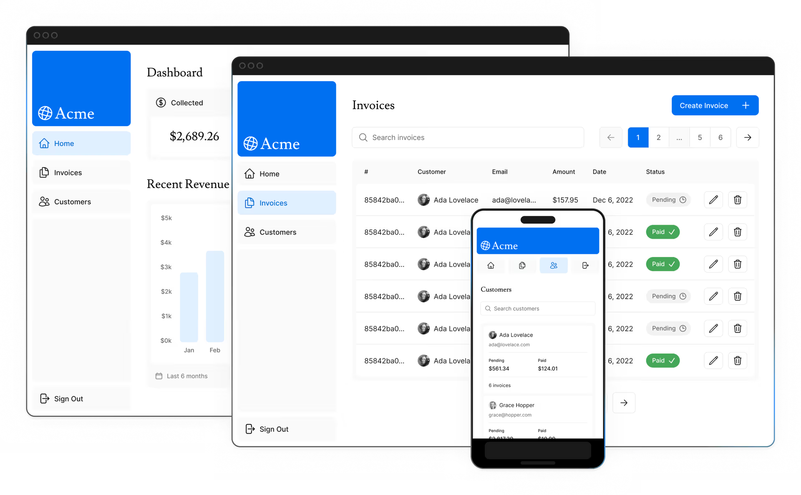
Untuk kursus ini, kita akan membangun **dashboard keuangan** yang memiliki:

- 🏠 **Halaman beranda publik**
- 🔐 **Halaman login**
- 📊 **Halaman dashboard yang dilindungi oleh autentikasi**
- 📝 **Kemampuan bagi pengguna untuk menambah, mengedit, dan menghapus invoice**

Dashboard ini juga akan dilengkapi dengan database, yang akan Anda setup di chapter selanjutnya.

> 🎓 **Di akhir kursus**, Anda akan memiliki keterampilan penting yang diperlukan untuk mulai membangun aplikasi Next.js full-stack.

---

## 📋 Gambaran Umum Fitur

Berikut adalah gambaran fitur-fitur yang akan Anda pelajari dalam kursus ini:

| 🔧 Fitur | 📖 Deskripsi |
|----------|--------------|
| **🎨 Styling** | Berbagai cara untuk mendesain aplikasi Anda di Next.js |
| **⚡ Optimasi** | Cara mengoptimalkan gambar, link, dan font |
| **🛣️ Routing** | Cara membuat layout dan halaman bertingkat menggunakan file-system routing |
| **📊 Data Fetching** | Cara setup database Postgres di Vercel, dan best practices untuk fetching dan streaming data |
| **🔍 Search & Pagination** | Cara mengimplementasikan pencarian dan pagination menggunakan URL search params |
| **🔄 Mutating Data** | Cara mengubah data menggunakan React Server Actions, dan revalidate cache Next.js |
| **❌ Error Handling** | Cara menangani error umum dan error `404` not found |
| **✅ Form Validation & Accessibility** | Cara melakukan validasi form server-side dan tips untuk meningkatkan aksesibilitas |
| **🔐 Authentication** | Cara menambahkan autentikasi ke aplikasi Anda menggunakan `NextAuth.js` dan Middleware |
| **📋 Metadata** | Cara menambahkan metadata dan mempersiapkan aplikasi Anda untuk social sharing |

---

## ⚠️ Pengetahuan Prasyarat

Kursus ini mengasumsikan Anda memiliki pemahaman dasar tentang:

- ⚛️ **React** (components, props, state, hooks)
- 📝 **JavaScript** (ES6+)
- 🆕 **Fitur React modern** (Server Components, Suspense)

> 💡 **Tip**: Jika Anda baru mengenal React, kami merekomendasikan untuk mengikuti kursus React Foundations terlebih dahulu.

---

## 💻 Persyaratan Sistem

Sebelum memulai kursus ini, pastikan sistem Anda memenuhi persyaratan berikut:

### 🔧 Software Requirements
- ✅ **Node.js 18.18.0** atau versi terbaru
- 💻 **Sistem operasi**: macOS, Windows (termasuk WSL), atau Linux

### 🌐 Account Requirements
- 📱 **GitHub Account**
- 🚀 **Vercel Account**

---

# 📖 CHAPTER 1: Memulai

## 🆕 Membuat Project Baru

### 📦 Package Manager Setup

Kami merekomendasikan menggunakan `pnpm` sebagai package manager Anda, karena **lebih cepat dan efisien** dibandingkan `npm` atau `yarn`.

```bash
# Install pnpm secara global
npm install -g pnpm
```

### 🏗️ Membuat Aplikasi Next.js

```bash
# Buat project Next.js dengan starter template
npx create-next-app@latest nextjs-dashboard \
  --example "https://github.com/vercel/next-learn/tree/main/dashboard/starter-example" \
  --use-pnpm
```

> 🔍 **Penjelasan**: Perintah ini menggunakan `create-next-app`, sebuah CLI tool yang mengatur aplikasi Next.js untuk Anda dengan starter example yang sudah disiapkan.

---

## 🗂️ Menjelajahi Project

### 💭 Filosofi Pembelajaran

> 🎯 **Berbeda dengan tutorial lain**, sebagian besar kode untuk kursus ini sudah ditulis untuk Anda. Ini lebih mencerminkan **pengembangan dunia nyata**, di mana Anda kemungkinan akan bekerja dengan codebase yang sudah ada.

**Tujuan kami**: Membantu Anda fokus mempelajari fitur-fitur utama Next.js, tanpa harus menulis *semua* kode aplikasi.

### 📁 Struktur Folder
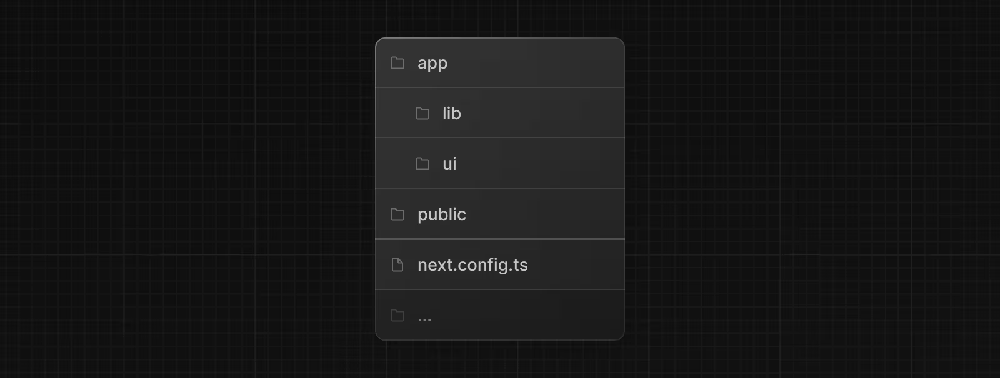
```bash
cd nextjs-dashboard
```

| 📂 Folder | 🎯 Fungsi |
|-----------|-----------|
| `/app` | 🏠 **Core aplikasi** - Routes, components, dan logic utama |
| `/app/lib` | 🔧 **Utilities** - Functions yang dapat digunakan kembali dan data fetching |
| `/app/ui` | 🎨 **UI Components** - Cards, tables, forms (sudah di-styling) |
| `/public` | 🖼️ **Static Assets** - Gambar dan file statis lainnya |
| **Config Files** | ⚙️ **Konfigurasi** - `next.config.ts` dan file config lainnya |

> 🎈 **Jangan khawatir** jika Anda belum memahami semua yang dilakukan kode tersebut!

---

## 📊 Data Placeholder

### 🤔 Mengapa Menggunakan Placeholder Data?

Ketika membangun user interfaces, sangat membantu untuk memiliki data contoh. Jika database atau API belum tersedia, Anda bisa:

- 📄 **JSON format** atau JavaScript objects
- 🌐 **Layanan pihak ketiga** seperti mockAPI

### 💾 Contoh Data Structure

File: `/app/lib/placeholder-data.ts`

```typescript
const invoices = [
  {
    customer_id: customers[0].id,
    amount: 15795,
    status: 'pending',
    date: '2022-12-06',
  },
  {
    customer_id: customers[1].id,
    amount: 20348,
    status: 'pending',
    date: '2022-11-14',
  },
  // ...
];
```

> 🌱 **Next Step**: Dalam chapter tentang database setup, Anda akan menggunakan data ini untuk *seed* database Anda.

---

## 🔷 TypeScript

### 📝 Mengapa TypeScript?

Project ini ditulis dalam **TypeScript** untuk mencerminkan landscape web modern.

> 😌 **Jangan khawatir** jika Anda belum tahu TypeScript - kami akan menyediakan snippet kode ketika diperlukan!

### 🏷️ Type Definitions

File: `/app/lib/definitions.ts`

```typescript
export type Invoice = {
  id: string;
  customer_id: string;
  amount: number;
  date: string;
  // String union type - hanya bisa 'pending' atau 'paid'
  status: 'pending' | 'paid';
};
```

### ✨ Keuntungan TypeScript

- 🛡️ **Type Safety** - Mencegah error format data
- 💡 **Auto-completion** - IDE support yang lebih baik
- 🔍 **Early Error Detection** - Catch bugs sebelum runtime

### 🏆 Pro Tips untuk TypeScript Developers

- 🗄️ **Prisma atau Drizzle** - Auto-generate types dari database schema
- 🔧 **Next.js Auto-detection** - Otomatis install packages dan konfigurasi TypeScript
- 🎯 **TypeScript Plugin** - Built-in support untuk code editor

---

## 🚀 Menjalankan Development Server

### 📦 Install Dependencies

```bash
# Install semua packages project
pnpm i
```

### 🔥 Start Development Server

```bash
# Jalankan development server
pnpm dev
```

> 🌐 **Development server** akan berjalan di port `3000`

### 🎉 Testing Setup

Buka browser dan navigasi ke:
```
http://localhost:3000
```
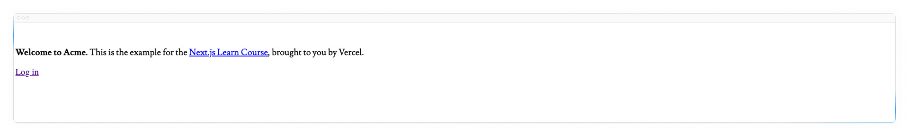
**Expected Result**: Halaman beranda yang sengaja tidak di-styling (ini normal untuk tahap awal!)

---

## 🎯 Summary Chapter 1

✅ **Yang telah kita pelajari:**

- 🏗️ Setup project Next.js dengan starter template
- 📁 Memahami struktur folder aplikasi
- 💾 Konsep placeholder data untuk development
- 🔷 Pengenalan TypeScript dalam Next.js
- 🚀 Menjalankan development server

✨ **Next Chapter Preview**: Kita akan mulai membangun UI dan mempelajari tentang styling di Next.js!

---

# 🎨 CHAPTER 2: CSS Styling

Saat ini, halaman beranda Anda belum memiliki styling apapun. Mari kita lihat berbagai cara untuk mendesain aplikasi Next.js Anda.

## 📚 Dalam Chapter Ini...

Yang akan kita pelajari:

- 🌐 **Global CSS file** - Cara menambahkan file CSS global ke aplikasi
- 🎯 **Dua metode styling** - Tailwind dan CSS modules  
- 🔀 **Conditional class names** - Menggunakan utility package `clsx`

---

## 🌍 Global Styles

### 📁 File Global CSS

Di dalam folder `/app/ui`, Anda akan menemukan file bernama `global.css`. File ini digunakan untuk menambahkan CSS rules ke **semua** routes dalam aplikasi Anda, seperti:

- 🔄 **CSS reset rules**
- 🌐 **Site-wide styles** untuk elemen HTML
- 🔗 **Global styling** untuk links dan komponen umum

### 🏗️ Import Global CSS

> 💡 **Best Practice**: Import `global.css` di top-level component (root layout)

File: `/app/layout.tsx`

```typescript
import '@/app/ui/global.css';

export default function RootLayout({
  children,
}: {
  children: React.ReactNode;
}) {
  return (
    <html lang="en">
      <body>{children}</body>
    </html>
  );
}
```

### 🎉 Hasil

Setelah menyimpan perubahan, halaman beranda Anda akan terlihat berbeda! Tapi tunggu... Anda belum menambahkan CSS rules apapun, dari mana styling ini berasal?

### 🔍 Rahasia Global CSS

Jika Anda melihat ke dalam `global.css`, Anda akan melihat beberapa `@tailwind` directives:

```css
@tailwind base;
@tailwind components;
@tailwind utilities;
```

---

## 🌬️ Tailwind CSS

### ⚡ Apa itu Tailwind?

**Tailwind** adalah CSS framework yang mempercepat proses development dengan memungkinkan Anda menulis utility classes langsung di React code.

### 🎨 Cara Kerja Tailwind

```typescript
// Contoh penggunaan Tailwind
<h1 className="text-blue-500">I'm blue!</h1>
```

### ✨ Keunggulan Tailwind

| 🏆 Keuntungan | 📖 Penjelasan |
|---------------|---------------|
| **🎯 Scope Singular** | Setiap class hanya diterapkan pada elemen tertentu |
| **🚫 No Style Collisions** | Tidak ada konflik antar stylesheet |
| **📦 Bundle Size** | CSS bundle tidak membesar seiring scale aplikasi |
| **🔧 Maintainable** | Mudah add/delete elemen tanpa khawatir stylesheet |

### 🚀 Auto Setup

Ketika menggunakan `create-next-app`, Next.js akan menanyakan apakah Anda ingin menggunakan Tailwind. Jika memilih `yes`, Next.js akan otomatis:

- 📦 Install packages yang diperlukan
- ⚙️ Konfigurasi Tailwind di aplikasi

### 🔍 Contoh Penggunaan

File: `/app/page.tsx`

```typescript
import AcmeLogo from '@/app/ui/acme-logo';
import { ArrowRightIcon } from '@heroicons/react/24/outline';
import Link from 'next/link';

export default function Page() {
  return (
    // Ini adalah Tailwind classes:
    <main className="flex min-h-screen flex-col p-6">
      <div className="flex h-20 shrink-0 items-end rounded-lg bg-blue-500 p-4 md:h-52">
        // ...
      </div>
    </main>
  );
}
```

### 🎮 Mari Bermain dengan Tailwind!

Coba copy kode berikut dan paste di atas elemen `<p>` di `/app/page.tsx`:

```typescript
<div 
  className="relative w-0 h-0 border-l-[15px] border-r-[15px] border-b-[26px] border-l-transparent border-r-transparent border-b-black"
/>
```

> 🎯 **Challenge**: Coba tebak bentuk apa yang akan muncul dari kode CSS di atas!

---

## 📦 CSS Modules

### 🎯 Apa itu CSS Modules?

**CSS Modules** memungkinkan Anda untuk scope CSS ke component dengan otomatis membuat unique class names, sehingga tidak perlu khawatir tentang style collisions.

> 💭 **Alternative**: Jika Anda prefer menulis traditional CSS rules atau memisahkan styles dari JSX

### 🛠️ Implementasi CSS Modules

#### Step 1: Buat CSS Module File

File: `/app/ui/home.module.css`

```css
.shape {
  height: 0;
  width: 0;
  border-bottom: 30px solid black;
  border-left: 20px solid transparent;
  border-right: 20px solid transparent;
}
```

#### Step 2: Import dan Gunakan

File: `/app/page.tsx`

```typescript
import AcmeLogo from '@/app/ui/acme-logo';
import { ArrowRightIcon } from '@heroicons/react/24/outline';
import Link from 'next/link';
import styles from '@/app/ui/home.module.css';

export default function Page() {
  return (
    <main className="flex min-h-screen flex-col p-6">
      <div className={styles.shape} />
      // ...
    </main>
  );
}
```

### 🎊 Hasil

Anda akan melihat bentuk yang sama seperti sebelumnya! 

> 🤝 **Flexibility**: Tailwind dan CSS modules adalah dua cara paling umum untuk styling Next.js applications. Anda bahkan bisa menggunakan keduanya dalam aplikasi yang sama!

---

## 🔀 Menggunakan Library `clsx` untuk Toggle Class Names

### 🤔 Kapan Digunakan?

Ada kalanya Anda perlu **conditionally style** sebuah elemen berdasarkan state atau kondisi tertentu.

### 📚 Apa itu clsx?

`clsx` adalah library yang memungkinkan Anda toggle class names dengan mudah.

### 🎯 Contoh Penggunaan

**Scenario**: Membuat `InvoiceStatus` component yang menerima `status`

- 💰 **'paid'** → warna hijau
- ⏳ **'pending'** → warna abu-abu

File: `/app/ui/invoices/status.tsx`

```typescript
import clsx from 'clsx';

export default function InvoiceStatus({ status }: { status: string }) {
  return (
    <span
      className={clsx(
        'inline-flex items-center rounded-full px-2 py-1 text-sm',
        {
          'bg-gray-100 text-gray-500': status === 'pending',
          'bg-green-500 text-white': status === 'paid',
        },
      )}
    >
      // ...
    </span>
  );
}
```

### 🔍 Cara Kerja clsx

```typescript
clsx(
  'base-classes',           // Always applied
  {
    'class-1': condition1,  // Applied if condition1 is true
    'class-2': condition2,  // Applied if condition2 is true
  }
)
```

> 💡 **Tip**: Explore lebih dalam tentang clsx di dokumentasi resminya untuk penggunaan advanced!

---

## 🎨 Solusi Styling Lainnya

Selain pendekatan yang telah kita bahas, Anda juga bisa style aplikasi Next.js dengan:

### 🌈 Opsi Styling Tambahan

| 🛠️ Solution | 📖 Description |
|-------------|----------------|
| **🎯 Sass** | Import `.css` dan `.scss` files |
| **💅 CSS-in-JS** | styled-jsx, styled-components, emotion |
| **🎨 Other frameworks** | Bootstrap, Bulma, Foundation |

> 📚 **Referensi**: Lihat dokumentasi CSS Next.js untuk informasi lebih lengkap

---

## 🎯 Summary Chapter 2

✅ **Yang telah kita pelajari:**

- 🌐 **Global CSS** - Import dan setup global styling
- 🌬️ **Tailwind CSS** - Utility-first CSS framework untuk rapid development
- 📦 **CSS Modules** - Scoped CSS untuk menghindari style collisions
- 🔀 **clsx Library** - Conditional class names yang powerful
- 🎨 **Alternative solutions** - Sass, CSS-in-JS, dan framework lainnya

✨ **Next Chapter Preview**: Kita akan mempelajari tentang optimizing images, links, dan fonts di Next.js!

---

# 🎨 CHAPTER 3: Optimizing Fonts and Images

Di chapter sebelumnya, Anda telah mempelajari cara styling aplikasi Next.js. Mari lanjutkan mengerjakan halaman beranda dengan menambahkan custom font dan hero image.

## 📚 Dalam Chapter Ini...

Yang akan kita pelajari:

- 🔤 **Custom fonts** - Cara menambahkan font kustom dengan `next/font`
- 🖼️ **Image optimization** - Cara menambahkan gambar dengan `next/image`
- ⚡ **Optimization techniques** - Bagaimana fonts dan images dioptimalkan di Next.js

---

## 🔤 Mengapa Optimasi Font Penting?

### 🎨 Peran Font dalam Website

Font memainkan peran penting dalam desain website, tetapi menggunakan custom fonts dapat mempengaruhi performance jika file font perlu di-fetch dan di-load.

### 📏 Cumulative Layout Shift (CLS)

**Cumulative Layout Shift** adalah metrik yang digunakan Google untuk mengevaluasi performance dan user experience website.

#### 🔄 Bagaimana Layout Shift Terjadi dengan Font:

1. **Initial Load** → Browser render text dengan fallback/system font
2. **Custom Font Loads** → Browser swap ke custom font  
3. **Layout Changes** → Text size, spacing, atau layout berubah
4. **Elements Shift** → Elemen di sekitarnya ikut bergeser

> 📊 **Visual**: Mock UI showing initial load → layout shift saat custom font loads
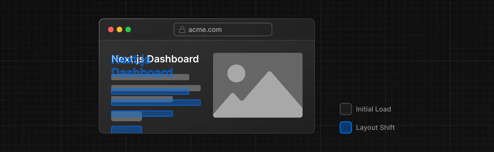
### ⚡ Optimasi Font Next.js

Next.js **otomatis mengoptimalkan fonts** ketika Anda menggunakan module `next/font`:

| 🎯 Optimasi | 📖 Penjelasan |
|-------------|---------------|
| **🏗️ Build Time Download** | Download font files saat build time |
| **📦 Static Asset Hosting** | Host fonts bersama static assets lainnya |
| **🚫 No Additional Requests** | Tidak ada network request tambahan untuk fonts |
| **🚀 Better Performance** | User experience yang lebih lancar |

---

## 🔤 Menambahkan Primary Font

### 📁 Setup Font File

Mari tambahkan custom Google font untuk melihat cara kerjanya.

#### Step 1: Buat Font Configuration

File: `/app/ui/fonts.ts`

```typescript
import { Inter } from 'next/font/google';

export const inter = Inter({ subsets: ['latin'] });
```

#### Step 2: Apply Font ke Layout

File: `/app/layout.tsx`

```typescript
import '@/app/ui/global.css';
import { inter } from '@/app/ui/fonts';

export default function RootLayout({
  children,
}: {
  children: React.ReactNode;
}) {
  return (
    <html lang="en">
      <body className={`${inter.className} antialiased`}>{children}</body>
    </html>
  );
}
```

### 🎯 Penjelasan Implementation

- **🌐 Global Application** - Font diterapkan ke seluruh aplikasi melalui `<body>` element
- **✨ Antialiased Class** - Tailwind class untuk menghaluskan font rendering
- **🔍 Dev Tools Check** - Buka browser dev tools → select body element → lihat `Inter` dan `Inter_Fallback` di styles

---

## 🎨 Practice: Menambahkan Secondary Font

### 💪 Challenge untuk Anda!

Tambahkan font secondary bernama **Lusitana** untuk elemen tertentu:

#### 🎯 Requirements:
- 📝 Import Lusitana font di `fonts.ts`
- 🎨 Apply ke elemen `<p>` di `/app/page.tsx`
- ⚖️ Specify font weights: **400** (normal) dan **700** (bold)

#### 💡 Hints:
- 🔍 Cek TypeScript errors untuk melihat weight options
- 🌐 Visit Google Fonts website untuk melihat Lusitana options
- 📚 Lihat dokumentasi Next.js untuk adding multiple fonts

#### ✅ Solution:

<details>
<summary>🔍 Lihat Solution</summary>

**File: `/app/ui/fonts.ts`**
```typescript
import { Inter, Lusitana } from 'next/font/google';

export const inter = Inter({ subsets: ['latin'] });

export const lusitana = Lusitana({
  weight: ['400', '700'],
  subsets: ['latin'],
});
```

**File: `/app/page.tsx`**
```typescript
import { lusitana } from '@/app/ui/fonts';

// Apply ke elemen <p>
<p className={`${lusitana.className} text-xl text-gray-800 md:text-3xl md:leading-normal`}>
  Welcome to Acme Dashboard
</p>
```
</details>

### 🎨 Uncomment AcmeLogo

File: `/app/page.tsx`

```typescript
export default function Page() {
  return (
    <main className="flex min-h-screen flex-col p-6">
      <div className="flex h-20 shrink-0 items-end rounded-lg bg-blue-500 p-4 md:h-52">
        <AcmeLogo />  {/* Uncomment this line */}
        {/* ... */}
      </div>
    </main>
  );
}
```

> 🎉 **Great!** Anda telah menambahkan dua custom fonts ke aplikasi!

---

## 🖼️ Mengapa Optimasi Images Penting?

### 📁 Static Assets di Next.js

Next.js dapat serve static assets seperti images di folder `/public`. Files di dalam `/public` dapat direferensikan dalam aplikasi.

### 🏷️ Regular HTML vs Next.js

#### 🚫 Regular HTML Approach:
```html

```

#### ⚠️ Manual Tasks yang Diperlukan:
- 📱 **Responsive Images** - Ensure image responsive di berbagai screen sizes
- 📐 **Image Sizes** - Specify ukuran untuk berbagai devices  
- 🔄 **Layout Shift Prevention** - Prevent layout shift saat images load
- 👁️ **Lazy Loading** - Lazy load images di luar viewport

> 🎯 **Image Optimization** adalah topik besar dalam web development yang bisa menjadi spesialisasi tersendiri!

---

## 🖼️ Component `<Image>`

### ✨ Automatic Image Optimization

`<Image>` Component adalah extension dari HTML `` tag dengan optimasi otomatis:

| 🚀 Feature | 📖 Benefit |
|------------|------------|
| **🔄 Layout Shift Prevention** | Otomatis prevent layout shift saat loading |
| **📱 Responsive Resizing** | Resize images sesuai viewport device |
| **👁️ Lazy Loading** | Default lazy loading (load saat enter viewport) |
| **🆕 Modern Formats** | Serve WebP dan AVIF jika browser support |

---

## 🖥️ Menambahkan Desktop Hero Image

### 📂 Available Images

Di folder `/public`, terdapat dua images:
- 🖥️ **hero-desktop.png** - Untuk desktop devices
- 📱 **hero-mobile.png** - Untuk mobile devices

### 🔧 Implementation

File: `/app/page.tsx`

```typescript
import AcmeLogo from '@/app/ui/acme-logo';
import { ArrowRightIcon } from '@heroicons/react/24/outline';
import Link from 'next/link';
import { lusitana } from '@/app/ui/fonts';
import Image from 'next/image';

export default function Page() {
  return (
    // ...
    <div className="flex items-center justify-center p-6 md:w-3/5 md:px-28 md:py-12">
      {/* Add Hero Images Here */}
      <Image
        src="/hero-desktop.png"
        width={1000}
        height={760}
        className="hidden md:block"
        alt="Screenshots of the dashboard project showing desktop version"
      />
    </div>
    //...
  );
}
```

### 🎯 Penjelasan Properties

- **📐 Width & Height** - `width={1000}` `height={760}` untuk aspect ratio yang benar
- **🙈 Responsive Classes** - `hidden` (mobile) dan `md:block` (desktop)
- **⚠️ Layout Shift Prevention** - Dimensions mencegah layout shift
- **📝 Alt Text** - Untuk accessibility

> 💡 **Important**: Dimensions bukan ukuran render, tapi ukuran file asli untuk memahami aspect ratio!

---

## 📱 Practice: Menambahkan Mobile Hero Image

### 💪 Your Turn!

Tambahkan `<Image>` component kedua untuk `hero-mobile.png`:

#### 🎯 Requirements:
- 📐 **Dimensions**: width `560` dan height `620` pixels
- 📱 **Visibility**: Show di mobile screens, hidden di desktop
- 🔍 **Testing**: Gunakan dev tools untuk check responsive behavior

#### ✅ Solution:

<details>
<summary>🔍 Lihat Solution</summary>

```typescript
<Image
  src="/hero-mobile.png"
  width={560}
  height={620}
  className="block md:hidden"
  alt="Screenshots of the dashboard project showing mobile version"
/>
```

**Classes explanation:**
- `block` → Show di mobile
- `md:hidden` → Hide di desktop (md breakpoint ke atas)
</details>

### 🎊 Result

Halaman beranda Anda sekarang memiliki:
- ✅ Custom font (Inter + Lusitana)
- ✅ Responsive hero images (desktop + mobile)
- ✅ Optimized performance

---

## 📚 Recommended Reading

Masih banyak yang bisa dipelajari tentang optimasi:

### 📖 Documentation Links
- 🖼️ **Image Optimization Docs** - Next.js official documentation
- 🔤 **Font Optimization Docs** - Next.js font optimization guide
- 🌐 **MDN - Images Performance** - Improving web performance with images
- 🔤 **MDN - Web Fonts** - Comprehensive web fonts guide

### 🎯 Advanced Topics
- ⚡ **Core Web Vitals** - How they affect SEO
- 🤖 **Google JavaScript** - How Google handles JS during indexing
- 🌐 **Remote Images** - Optimizing images from external sources
- 📁 **Local Font Files** - Using custom local fonts

---

## 🎯 Summary Chapter 3

✅ **Yang telah kita pelajari:**

- 🔤 **Font Optimization** - Setup custom fonts dengan `next/font`
- 📏 **CLS Prevention** - Mencegah Cumulative Layout Shift
- 🖼️ **Image Optimization** - Menggunakan `<Image>` component
- 📱 **Responsive Images** - Desktop dan mobile hero images
- ⚡ **Performance Benefits** - Automatic optimizations oleh Next.js

✨ **Next Chapter Preview**: Kita akan mempelajari tentang creating layouts dan pages menggunakan file-system routing!

---

# 🏗️ CHAPTER 4: Creating Layouts and Pages

Sejauh ini, aplikasi Anda hanya memiliki halaman beranda. Mari belajar cara membuat lebih banyak routes dengan layouts dan pages.

## 📚 Dalam Chapter Ini...

Yang akan kita pelajari:

- 🛣️ **Dashboard routes** - Membuat routes menggunakan file-system routing
- 📁 **Folders & files** - Memahami peran folder dan file dalam route segments
- 🔗 **Nested layout** - Membuat layout yang dapat dibagikan antar halaman
- 🎯 **Key concepts** - Colocation, partial rendering, dan root layout

---

## 🗂️ Nested Routing

### 🛣️ File-System Routing

Next.js menggunakan **file-system routing** dimana folder digunakan untuk membuat nested routes. Setiap folder merepresentasikan route segment yang dipetakan ke URL segment.

```
📁 app/
├── 📄 page.tsx          → / (home page)
├── 📁 dashboard/
│   ├── 📄 page.tsx      → /dashboard
│   ├── 📁 customers/
│   │   └── 📄 page.tsx  → /dashboard/customers
│   └── 📁 invoices/
│       └── 📄 page.tsx  → /dashboard/invoices
```
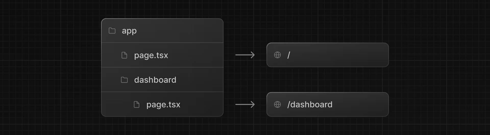
### 🎯 Konsep Dasar

| 📄 File | 🎯 Fungsi |
|---------|-----------|
| **`page.tsx`** | File khusus yang export React component - **required** untuk route dapat diakses |
| **`layout.tsx`** | UI yang dibagikan antar multiple pages |
| **Folder names** | Menentukan URL path structure |

---

## 📊 Membuat Dashboard Page

### 🏗️ Setup Dashboard Route

#### Step 1: Buat Dashboard Folder & Page

```typescript
// File: /app/dashboard/page.tsx
export default function Page() {
  return <p>Dashboard Page</p>;
}
```

#### Step 2: Test Route

- 🚀 Pastikan development server berjalan: `pnpm dev`
- 🌐 Visit: `http://localhost:3000/dashboard`
- ✅ Anda akan melihat teks "Dashboard Page"

### 🎯 Cara Kerja Route Creation

1. **📁 Folder** → Membuat route segment  
2. **📄 page.tsx** → Membuat accessible route
3. **🔗 URL mapping** → Folder structure = URL structure

---

## 💪 Practice: Membuat Dashboard Pages

### 🎯 Challenge

Buat dua halaman tambahan di dashboard:

#### 📋 Requirements:

1. **👥 Customers Page**
   - **URL**: `http://localhost:3000/dashboard/customers`
   - **Content**: `<p>Customers Page</p>`

2. **📄 Invoices Page**  
   - **URL**: `http://localhost:3000/dashboard/invoices`
   - **Content**: `<p>Invoices Page</p>`

#### ✅ Solution:

<details>
<summary>🔍 Lihat Solution</summary>

**File: `/app/dashboard/customers/page.tsx`**
```typescript
export default function Page() {
  return <p>Customers Page</p>;
}
```

**File: `/app/dashboard/invoices/page.tsx`**
```typescript
export default function Page() {
  return <p>Invoices Page</p>;
}
```

**Struktur folder yang dihasilkan:**
```
📁 app/
├── 📄 page.tsx
└── 📁 dashboard/
    ├── 📄 page.tsx
    ├── 📁 customers/
    │   └── 📄 page.tsx
    └── 📁 invoices/
        └── 📄 page.tsx
```
</details>

---

## 🎨 Membuat Dashboard Layout

### 🤔 Mengapa Layout Diperlukan?

Dashboard biasanya memiliki navigasi yang **dibagikan antar multiple pages**. Next.js menggunakan file khusus `layout.tsx` untuk membuat UI yang shared.

### 🏗️ Implementation Dashboard Layout

File: `/app/dashboard/layout.tsx`

```typescript
import SideNav from '@/app/ui/dashboard/sidenav';

export default function Layout({ children }: { children: React.ReactNode }) {
  return (
    <div className="flex h-screen flex-col md:flex-row md:overflow-hidden">
      <div className="w-full flex-none md:w-64">
        <SideNav />
      </div>
      <div className="flex-grow p-6 md:overflow-y-auto md:p-12">{children}</div>
    </div>
  );
}
```

### 🔍 Code Breakdown

| 🔧 Element | 📖 Penjelasan |
|------------|---------------|
| **`<SideNav />`** | Component navigasi yang diimport ke layout |
| **`children` prop** | Bisa berupa page atau layout lainnya |
| **Auto nesting** | Pages di `/dashboard` otomatis nested dalam `<Layout />` |
| **Responsive design** | Flex column (mobile) → flex row (desktop) |

### 🎊 Visual Result
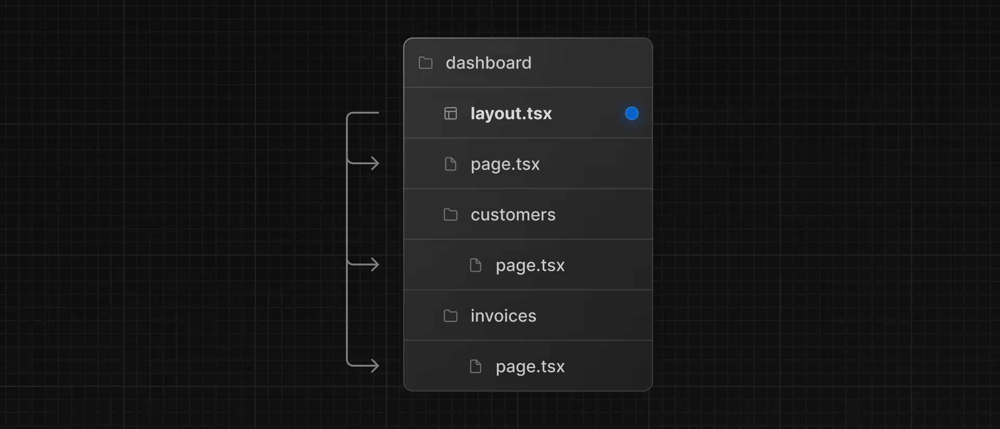
Setelah save changes dan check localhost:
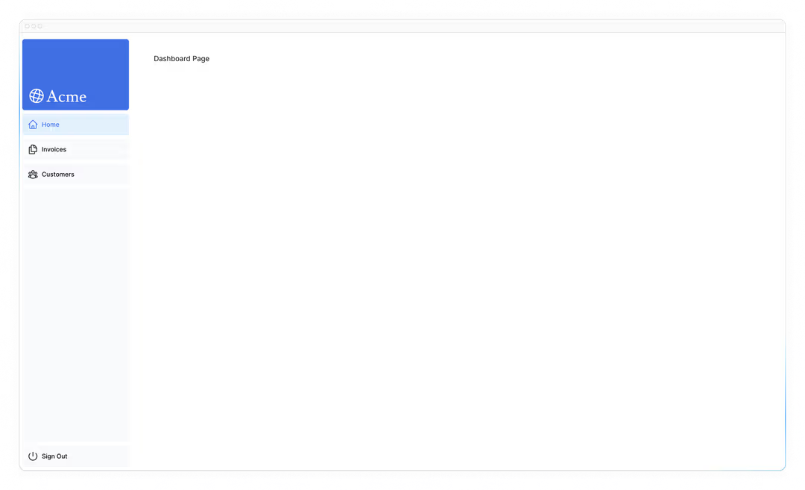
```
┌─────────────────────────────────────┐
│ 📱 SideNav    │ 📄 Dashboard Page   │
│ - Dashboard   │                     │
│ - Customers   │ Main Content Area   │
│ - Invoices    │                     │
└─────────────────────────────────────┘
```

---

## ⚡ Partial Rendering

### 🎯 Keuntungan Layout di Next.js

> 💡 **Partial Rendering**: Saat navigasi, hanya page components yang update sedangkan layout **tidak re-render**

#### 🔄 Navigation Behavior:
- ✅ **Layout tetap** → SideNav tidak re-render
- 🔄 **Page berubah** → Konten utama berubah sesuai route
- 🚀 **Performa optimal** → Client-side React state preserved

```
Dashboard Layout (persistent)
├── SideNav (no re-render) ✅
└── Children (re-renders) 🔄
    ├── /dashboard → Dashboard Page
    ├── /dashboard/customers → Customers Page  
    └── /dashboard/invoices → Invoices Page
```

---
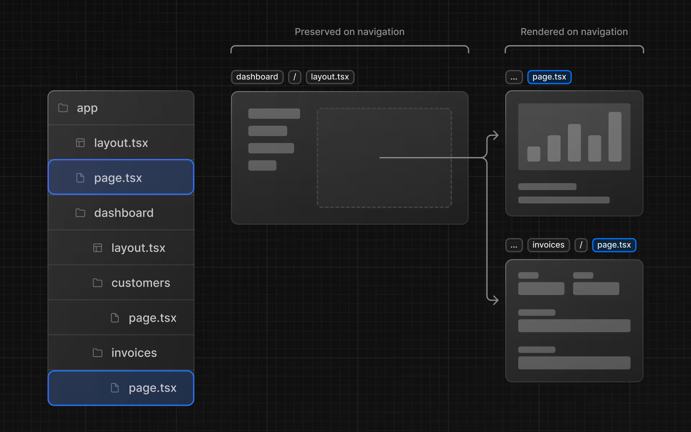
## 🌳 Root Layout

### 📋 Apa itu Root Layout?

File `/app/layout.tsx` adalah **root layout** yang required di setiap Next.js application.

File: `/app/layout.tsx`

```typescript
import '@/app/ui/global.css';
import { inter } from '@/app/ui/fonts';

export default function RootLayout({
  children,
}: {
  children: React.ReactNode;
}) {
  return (
    <html lang="en">
      <body className={`${inter.className} antialiased`}>{children}</body>
    </html>
  );
}
```

### 🎯 Karakteristik Root Layout

| 🏷️ Property | 📖 Description |
|-------------|----------------|
| **🌐 Global scope** | UI diterapkan ke **semua pages** dalam aplikasi |
| **📄 HTML structure** | Dapat modify `<html>` dan `<body>` tags |
| **📋 Metadata** | Tempat untuk add metadata (akan dipelajari later) |
| **⚡ Performance** | Font dan global styles di-load once |

### 🔗 Layout Hierarchy

```
Root Layout (/app/layout.tsx)
└── Dashboard Layout (/app/dashboard/layout.tsx)
    ├── Dashboard Page
    ├── Customers Page
    └── Invoices Page
```

---

## 🎯 Summary Chapter 4

✅ **Yang telah kita pelajari:**

- 🗂️ **File-system Routing** - Cara Next.js mapping folder ke URLs
- 📄 **page.tsx files** - Required files untuk accessible routes  
- 🎨 **Layout creation** - Shared UI components antar pages
- ⚡ **Partial rendering** - Performance optimization dengan layout persistence
- 🌳 **Root vs nested layouts** - Hierarchy dan scope yang berbeda
- 📁 **Colocation benefits** - Organizing related code bersama routes

### 🔧 **Practical Skills:**
- ✅ Membuat nested routes dengan folder structure
- ✅ Implementasi dashboard layout dengan SideNav
- ✅ Memahami children prop dan component nesting
- ✅ Responsive design dengan Tailwind classes

✨ **Next Chapter Preview**: Kita akan mempelajari navigation antar pages dan optimasi client-side routing!

---

# 🧭 CHAPTER 5: Navigating Between Pages

Di chapter sebelumnya, Anda telah membuat dashboard layout dan pages. Sekarang, mari tambahkan beberapa links agar users dapat navigasi antar dashboard routes.

## 📚 Dalam Chapter Ini...

Yang akan kita pelajari:

- 🔗 **next/link component** - Cara menggunakan Link component
- 🎯 **Active link indicator** - Menampilkan active link dengan `usePathname()` hook  
- ⚡ **Navigation optimization** - Bagaimana navigation bekerja di Next.js

---

## ⚡ Mengapa Optimasi Navigation Penting?

### 🚫 Traditional HTML Navigation

Untuk link antar pages, secara tradisional menggunakan `<a>` HTML element. Saat ini, sidebar links menggunakan `<a>` elements.

> 🔍 **Coba navigasi** antar home, invoices, dan customers pages di browser Anda. Apa yang terjadi?

**⚠️ Problem**: Terjadi **full page refresh** pada setiap page navigation!

---

## 🔗 Component `<Link>`

### ✨ Client-Side Navigation

Di Next.js, Anda bisa menggunakan `<Link />` Component untuk link antar pages dalam aplikasi. `<Link>` memungkinkan **client-side navigation** dengan JavaScript.

### 🛠️ Implementation

#### Step 1: Import dan Replace

File: `/app/ui/dashboard/nav-links.tsx`

```typescript
import {
  UserGroupIcon,
  HomeIcon,
  DocumentDuplicateIcon,
} from '@heroicons/react/24/outline';
import Link from 'next/link';

// ...

export default function NavLinks() {
  return (
    <>
      {links.map((link) => {
        const LinkIcon = link.icon;
        return (
          <Link
            key={link.name}
            href={link.href}
            className="flex h-[48px] grow items-center justify-center gap-2 rounded-md bg-gray-50 p-3 text-sm font-medium hover:bg-sky-100 hover:text-blue-600 md:flex-none md:justify-start md:p-2 md:px-3"
          >
            <LinkIcon className="w-6" />
            <p className="hidden md:block">{link.name}</p>
          </Link>
        );
      })}
    </>
  );
}
```

### 🎯 Perbedaan dengan HTML

| 🏷️ Method | 📖 Syntax |
|-----------|-----------|
| **HTML** | `<a href="...">` |
| **Next.js** | `<Link href="...">` |

#### Step 2: Test Navigation

- 💾 Save changes dan test di localhost
- ✅ Navigasi antar pages **tanpa full refresh**
- 🚀 Terasa seperti native web app!

---

## ⚡ Automatic Code-Splitting dan Prefetching

### 🔧 Code-Splitting Benefits

Next.js secara otomatis **code splits** aplikasi berdasarkan route segments:

| 🎯 Benefit | 📖 Explanation |
|------------|----------------|
| **🏝️ Page Isolation** | Jika satu page error, aplikasi lain masih berfungsi |
| **📦 Smaller Bundles** | Browser hanya load kode yang diperlukan |
| **🚀 Faster Loading** | Less code to parse = faster application |

### 🎯 Prefetching Magic

> 🪄 **Production magic**: Ketika `<Link>` components muncul di browser viewport, Next.js **otomatis prefetch** kode untuk linked route di background!

#### 🔄 Prefetching Process:
1. **👀 Link appears** → Dalam browser viewport
2. **⬇️ Auto prefetch** → Kode route di-download di background  
3. **👆 User clicks** → Page code sudah ready
4. **⚡ Instant transition** → Navigation terasa instantaneous

---

## 🎨 Pattern: Menampilkan Active Links

### 🎯 UI Pattern yang Umum

Menampilkan **active link** untuk mengindikasikan halaman saat ini kepada user.

### 🔧 Implementation dengan usePathname()

#### Step 1: Convert ke Client Component

File: `/app/ui/dashboard/nav-links.tsx`

```typescript
'use client';

import {
  UserGroupIcon,
  HomeIcon,
  DocumentDuplicateIcon,
} from '@heroicons/react/24/outline';
import Link from 'next/link';
import { usePathname } from 'next/navigation';

// ...
```

> 💡 **Why 'use client'?** `usePathname()` adalah React hook, jadi component harus menjadi Client Component.

#### Step 2: Get Current Path

```typescript
export default function NavLinks() {
  const pathname = usePathname();
  // ...
}
```

#### Step 3: Conditional Styling dengan clsx

Final code: `/app/ui/dashboard/nav-links.tsx`

```typescript
'use client';

import {
  UserGroupIcon,
  HomeIcon,
  DocumentDuplicateIcon,
} from '@heroicons/react/24/outline';
import Link from 'next/link';
import { usePathname } from 'next/navigation';
import clsx from 'clsx';

// ...

export default function NavLinks() {
  const pathname = usePathname();

  return (
    <>
      {links.map((link) => {
        const LinkIcon = link.icon;
        return (
          <Link
            key={link.name}
            href={link.href}
            className={clsx(
              'flex h-[48px] grow items-center justify-center gap-2 rounded-md bg-gray-50 p-3 text-sm font-medium hover:bg-sky-100 hover:text-blue-600 md:flex-none md:justify-start md:p-2 md:px-3',
              {
                'bg-sky-100 text-blue-600': pathname === link.href,
              },
            )}
          >
            <LinkIcon className="w-6" />
            <p className="hidden md:block">{link.name}</p>
          </Link>
        );
      })}
    </>
  );
}
```

### 🎯 Conditional Logic

```typescript
clsx(
  'base-classes',                    // Always applied
  {
    'active-classes': pathname === link.href,  // Applied when active
  }
)
```

#### Step 4: Test Active State

- 💾 Save dan check localhost
- ✅ Active link sekarang **highlighted dengan biru**
- 🔄 Navigasi antar pages untuk melihat active state berubah

---

## 🎯 Summary Chapter 5

✅ **Yang telah kita pelajari:**

- 🔗 **Link Component** - Client-side navigation dengan `<Link>`
- ⚡ **Performance Benefits** - Code-splitting dan prefetching otomatis
- 🎯 **Active Links** - Menggunakan `usePathname()` untuk UI feedback
- 🖥️ **Client vs Server** - Perbedaan Client Component dan Server Component
- 🎨 **Conditional Styling** - clsx untuk dynamic class application

### 🚀 **Technical Achievements:**
- ✅ Smooth navigation tanpa page refresh
- ✅ Optimized performance dengan automatic prefetching  
- ✅ Professional UI dengan active link indicators
- ✅ Understanding React hooks dalam Next.js context

✨ **Next Chapter Preview**: Setting up database dengan PostgreSQL untuk real data!

---

# 🗄️ CHAPTER 6: Setting Up Your Database

Sebelum melanjutkan dashboard, Anda memerlukan beberapa data. Di chapter ini, Anda akan setup PostgreSQL database dari integrasi marketplace Vercel.

## 📚 Dalam Chapter Ini...

Yang akan kita pelajari:

- 📤 **GitHub integration** - Push project ke GitHub
- 🚀 **Vercel deployment** - Setup akun dan deploy otomatis
- 🗄️ **PostgreSQL database** - Create dan link database
- 🌱 **Database seeding** - Populate dengan data awal

---

## 📤 Membuat GitHub Repository

### 🎯 Why GitHub First?

Push repository ke GitHub akan memudahkan setup database dan deployment.

> 🔗 **Need help?** Gunakan [Git & GitHub Guide](link-to-our-guide) yang sudah kita buat sebelumnya!

### 📋 Repository Setup Checklist

- ✅ Repository name: `nextjs-dashboard-course-[NIM]`
- ✅ Initial commit dengan all files
- ✅ Push ke GitHub successfully

### 💡 Alternative Git Providers

| 🔧 Provider | 📖 Notes |
|-------------|----------|
| **GitHub** | Recommended untuk integrasi Vercel |
| **GitLab** | Supported alternative |
| **Bitbucket** | Supported alternative |

> 🖥️ **For beginners**: GitHub Desktop App recommended untuk simplified workflow

---

## 🚀 Membuat Vercel Account

### 🔧 Account Setup

1. **🌐 Visit**: [vercel.com/signup](https://vercel.com/signup)
2. **📝 Plan**: Pilih gratis "hobby" plan  
3. **🔗 GitHub**: Select "Continue with GitHub"
4. **✅ Connect**: Link GitHub dan Vercel accounts

---

## 🔗 Connect dan Deploy Project

### 📋 Deployment Process

#### Step 1: Import Repository

Anda akan dibawa ke screen untuk select dan import GitHub repository yang baru dibuat:

```
┌─────────────────────────────────────┐
│  Import Git Repository             │
│  ○ nextjs-dashboard-course-123456  │
│  ○ other-repo-1                   │
│  ○ other-repo-2                   │
└─────────────────────────────────────┘
```
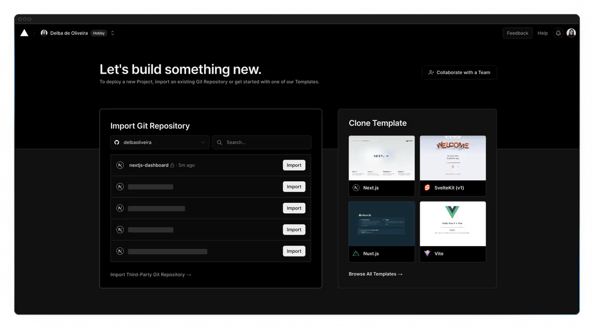
#### Step 2: Configure dan Deploy

1. **📝 Project name**: Biarkan default atau customize
2. **🚀 Deploy**: Click Deploy button
3. **⏳ Wait**: Proses deployment (~2-3 menit)
4. **🎉 Success**: Project deployed successfully!

### ✨ Auto-Deployment Benefits
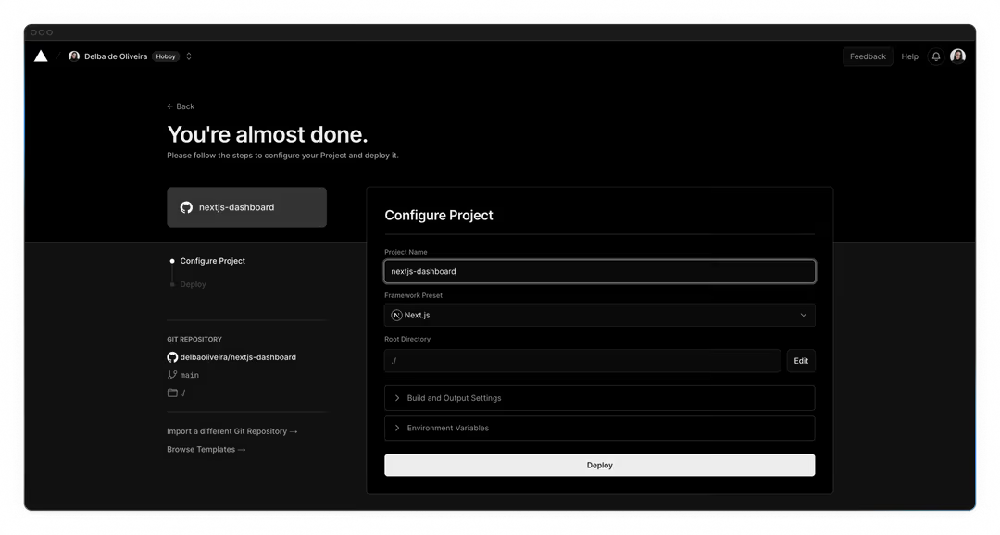
| 🎯 Feature | 📖 Benefit |
|------------|------------|
| **🔄 Auto redeploy** | Push ke main branch = auto deploy |
| **👀 Preview URLs** | Pull requests generate preview URLs |
| **🐛 Early error detection** | Catch deployment errors sebelum merge |
| **👥 Team collaboration** | Share previews dengan team members |

---
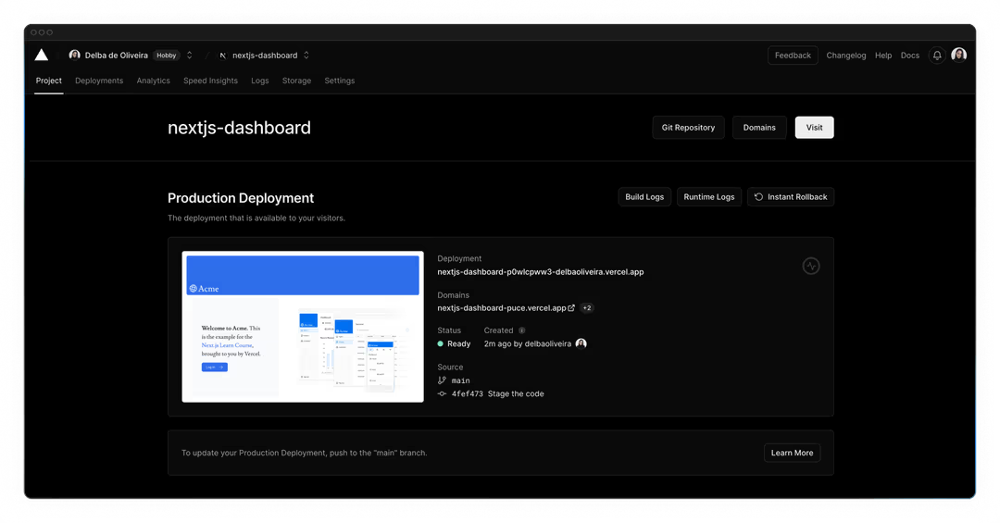
## 🗄️ Membuat Postgres Database

### 📊 Database Setup

#### Step 1: Access Storage Tab

1. **📈 Dashboard**: Click "Continue to Dashboard"
2. **📊 Storage**: Select Storage tab dari project dashboard  
3. **🆕 Create**: Click "Create Database"

#### Step 2: Choose Provider

Tergantung kapan Vercel account dibuat, Anda mungkin melihat options:

| 🔧 Provider | 📖 Description |
|-------------|----------------|
| **🟢 Neon** | Modern PostgreSQL platform |
| **🟦 Supabase** | Open source Firebase alternative |

> 💡 **Recommendation**: Pilih provider yang tersedia dan click Continue
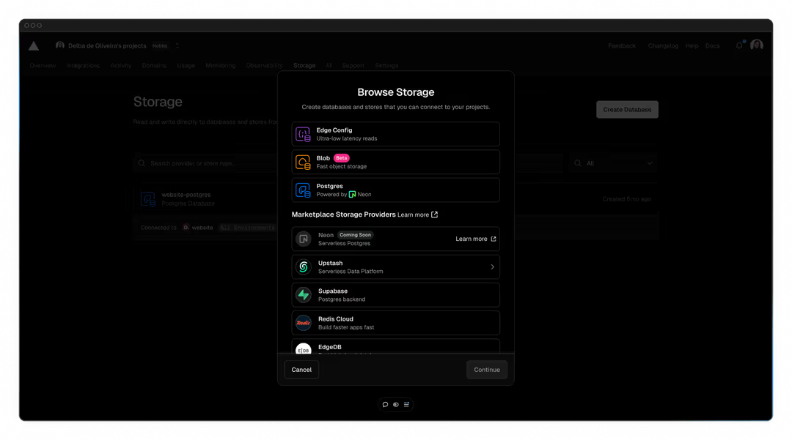
#### Step 3: Configure Database

```
┌─────────────────────────────────────┐
│  Database Configuration            │
│  📍 Region: Washington D.C (iad1)   │
│  💰 Plan: Hobby (Free)             │
│  📋 Name: [auto-generated]         │
└─────────────────────────────────────┘
```

> 🌍 **Region recommendation**: Washington D.C (iad1) untuk reduce latency
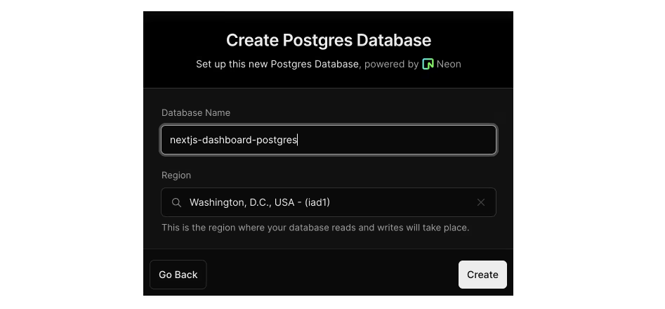
---

## 🔐 Environment Variables Setup

### 📋 Getting Database Secrets

#### Step 1: Navigate ke .env.local Tab

1. **🔍 Find**: .env.local tab di database dashboard
2. **👁️ Show secret**: Click "Show secret" button  
3. **📋 Copy**: Click "Copy Snippet"

> ⚠️ **Important**: Reveal secrets sebelum copy mereka!

#### Step 2: Local Environment Setup

1. **📝 Code editor**: Navigate ke code editor Anda
2. **🔄 Rename**: `.env.example` → `.env`
3. **📋 Paste**: Copied contents dari Vercel

### 🛡️ Security Best Practice

File: `.gitignore`

```gitignore
# Environment variables
.env
.env.local
.env.production.local
.env.development.local
```
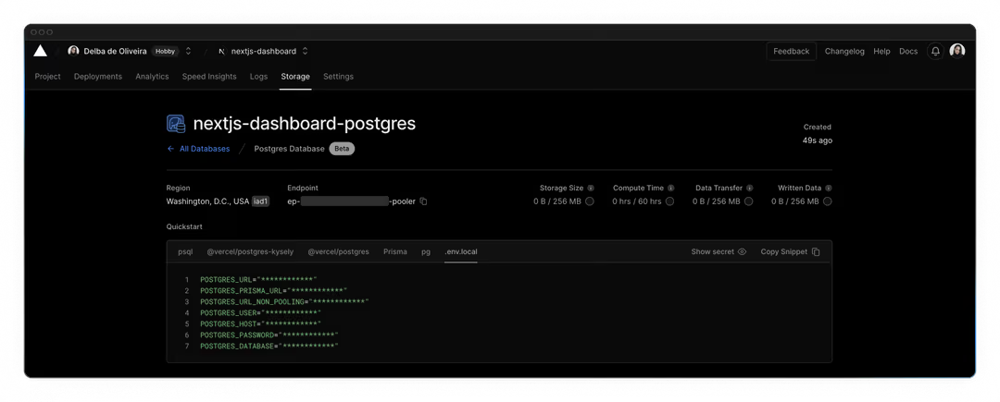
> 🔒 **Critical**: Pastikan `.env` ada di .gitignore untuk prevent database secrets exposure!

---

## 🌱 Seeding Database

### 🎯 Apa itu Database Seeding?

**Database seeding** adalah proses populate database dengan initial set of data untuk development/testing.

### 🛠️ Implementation

#### Step 1: Run Seed Script

1. **🚀 Dev server**: Pastikan running dengan `pnpm run dev`
2. **🌐 Navigate**: Ke `localhost:3000/seed` di browser
3. **⏳ Wait**: Script akan create tables dan populate data
4. **✅ Success**: Lihat message "Database seeded successfully"

#### Step 2: Clean Up

Setelah seeding sukses, Anda bisa **delete seed file** karena sudah tidak diperlukan.

### 🔧 Seed Script Process

```typescript
// Script menggunakan:
1. 📊 SQL queries → Create database tables
2. 📄 placeholder-data.ts → Populate tables dengan data
3. 🔐 bcrypt → Hash user passwords untuk security
```

---

## 🧪 Testing Database Connection

### 🔍 Executing Test Query

Mari execute query untuk memastikan semuanya berfungsi dengan baik.

#### Available Test Endpoint

File: `app/query/route.ts`

```sql
SELECT invoices.amount, customers.name
FROM invoices
JOIN customers ON invoices.customer_id = customers.id
WHERE invoices.amount = 666;
```

#### Step 1: Uncomment dan Test

1. **📝 Edit**: Uncomment file `app/query/route.ts`
2. **🗑️ Remove**: Response.json() block
3. **🌐 Navigate**: `localhost:3000/query` di browser
4. **✅ Result**: Invoice amount dan name returned

---

## 🛠️ Troubleshooting

### ⚠️ Common Issues

#### 1. Environment Variables
```bash
# Make sure to reveal secrets before copying
# Check .env file exists and has correct values
```

#### 2. bcrypt Compatibility
```bash
# If bcrypt issues, update script to use bcryptjs
npm install bcryptjs
```

#### 3. Re-seeding Database
```sql
-- If need to re-run seed script
DROP TABLE tablename; -- Careful: deletes all data!
```

### 🔍 Database Query Interface

Untuk executing queries dan troubleshooting:
- **Vercel Dashboard** → Storage → Your Database → Query interface
- **⚠️ Production warning**: Jangan run DROP commands di production app!

---

## 🎯 Summary Chapter 6

✅ **Yang telah kita pelajari:**

- 📤 **GitHub Integration** - Push project untuk deployment readiness
- 🚀 **Vercel Deployment** - Automated deployment dan preview URLs
- 🗄️ **PostgreSQL Setup** - Database creation dan connection
- 🔐 **Environment Security** - Proper .env management dan .gitignore
- 🌱 **Database Seeding** - Initial data population untuk development
- 🧪 **Query Testing** - Verifying database connection dengan SQL queries

### 🎉 **Major Achievements:**
- ✅ Full deployment pipeline setup
- ✅ Production-ready database integration  
- ✅ Secure environment variable management
- ✅ Working data layer untuk aplikasi

✨ **Next Chapter Preview**: Fetching real data dari database dan displaying di dashboard!

---

## 📋 Credits & Attribution

**📚 Original Material**: [Next.js Official Learn Dashboard Course](https://nextjs.org/learn/dashboard-app)  
**🏛️ Created by**: Next.js Team (Vercel)  
**🔄 Adapted by**: Laboran Informatika FT-UNISMUH  
**👨‍💻 Translator**: DevNoLife  
**🌐 Language**: Bahasa Indonesia  

> 💡 **Note**: Materi ini merupakan adaptasi dan terjemahan dari kursus resmi Next.js dengan penyesuaian untuk pembelajaran di lingkungan akademik Indonesia.
